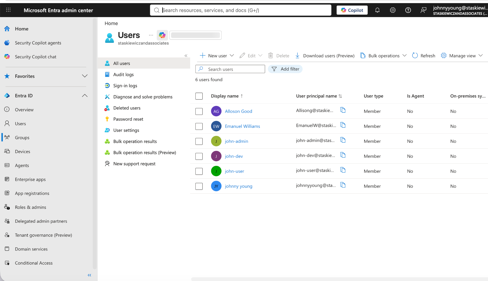
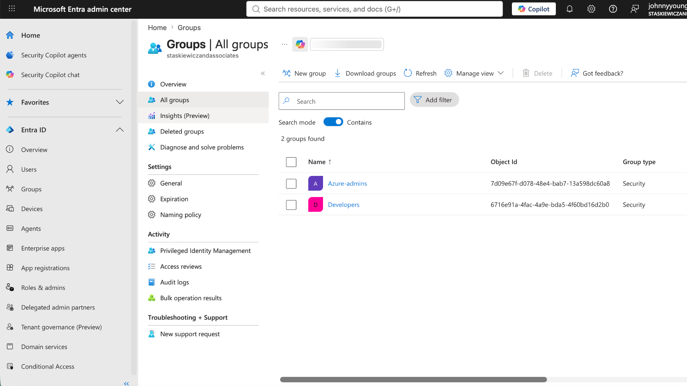
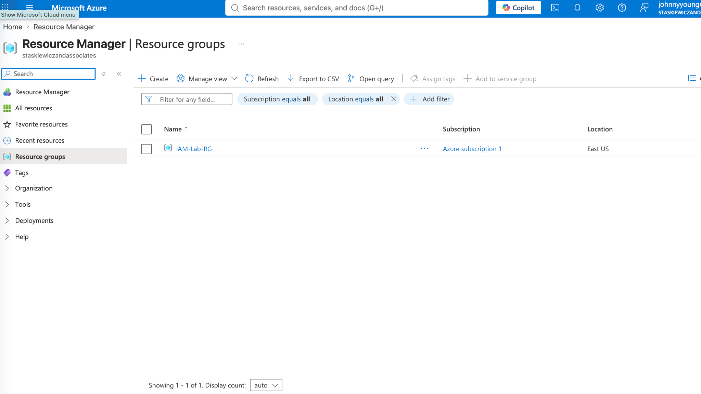
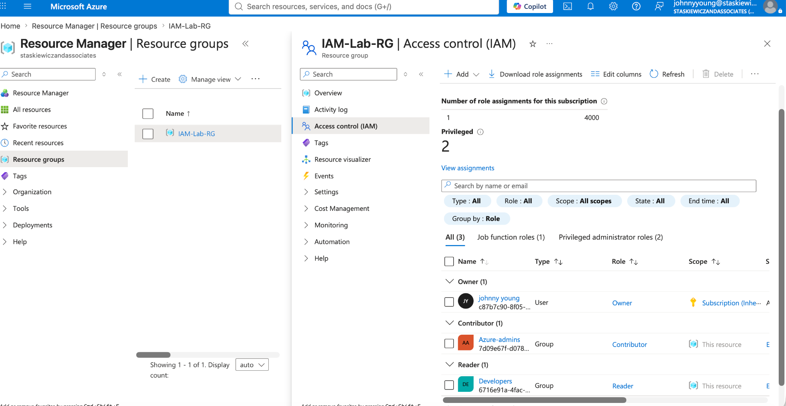
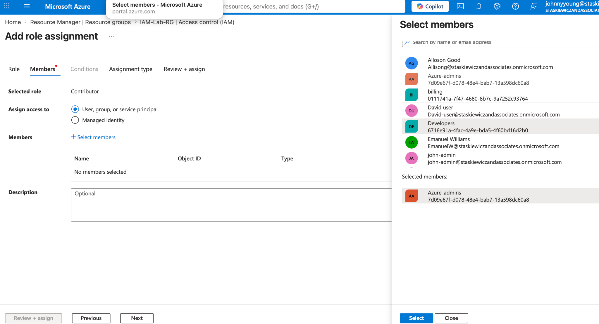
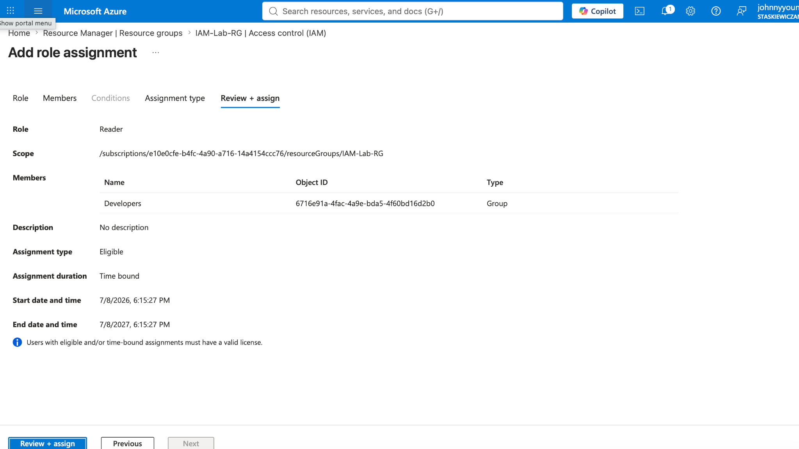
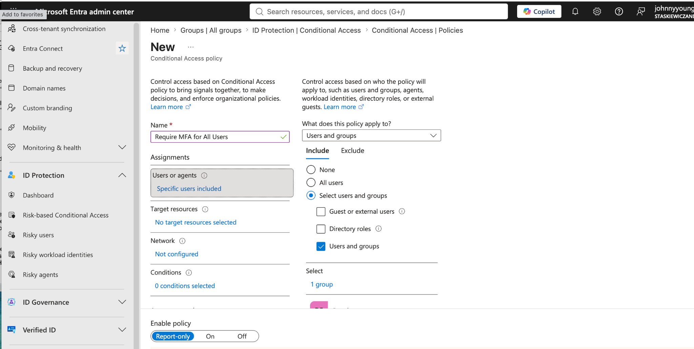
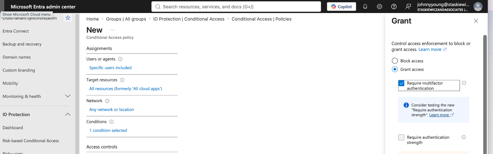
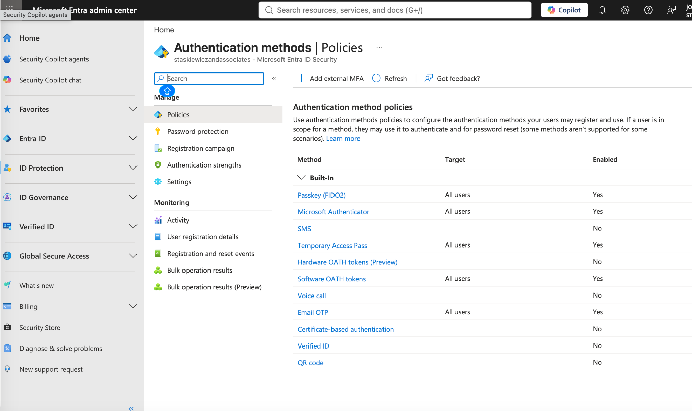
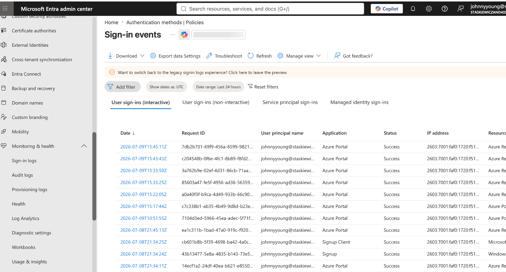

# 🔐 Azure Identity and Access Management (IAM) Project

This project demonstrates the practical implementation of **Identity and Access Management (IAM)** in a Microsoft Azure / Microsoft Entra ID environment. The lab focuses on applying **least privilege** and **Zero Trust** principles by creating users and groups, assigning Azure RBAC roles, enforcing **Conditional Access** with **Multi-Factor Authentication (MFA)**, and reviewing sign-in activity.

---

## 📌 Project Objectives

- Create and manage users and security groups in **Microsoft Entra ID**
- Implement **Role-Based Access Control (RBAC)** on an Azure resource group
- Configure a **Conditional Access** policy to require MFA
- Review **Authentication Methods** used for MFA in Microsoft Entra ID
- Validate identity activity using **Sign-in Logs**

---

## 🧠 Skills Demonstrated

- Identity & Access Management (IAM)
- Microsoft Entra ID administration
- Azure Role-Based Access Control (RBAC)
- Conditional Access policy configuration
- Multi-Factor Authentication (MFA)
- Least privilege / Zero Trust security concepts
- Security monitoring and access review

---

## 🛠️ Tools & Services Used

- **Microsoft Azure Portal**
- **Microsoft Entra ID**
- **Azure Resource Groups**
- **Access Control (IAM)**
- **Conditional Access**
- **Authentication Methods**
- **Sign-in Logs**

---

# 🔍 Project Walkthrough

## 1️⃣ Create Users in Microsoft Entra ID

Three test users were created in Microsoft Entra ID to simulate different roles within the environment:

- **john-admin**
- **john-dev**
- **john-user**

These users were used throughout the lab to demonstrate how access can be assigned differently depending on job function and privilege level.

### Navigation
**Microsoft Entra admin center → Users → All users → New user**

### Screenshot


---

## 2️⃣ Create Security Groups

Two **security groups** were created to simplify permission assignments:

- **Azure-admins**
- **Developers**

Users were then placed into groups based on their role:

- **john-admin** → Azure-admins  
- **john-dev** → Developers  

Using groups instead of assigning permissions directly to individual users is a more scalable and realistic IAM approach.

### Navigation
**Microsoft Entra admin center → Groups → New group**

### Screenshot


---

## 3️⃣ Create an Azure Resource Group

A dedicated Azure resource group named **IAM-Lab-RG** was created to act as the scope for RBAC role assignments. This allowed access to be controlled at the resource group level rather than across the entire subscription.

### Resource Group
- **Name:** `IAM-Lab-RG`

### Navigation
**Azure Portal → Resource groups → Create**

### Screenshot


---

## 4️⃣ Configure Azure RBAC Role Assignments

After creating the resource group, **Azure Role-Based Access Control (RBAC)** was configured through **Access control (IAM)**.

### Role Assignments Implemented
- **Azure-admins** → **Contributor**
- **Developers** → **Reader**

This structure demonstrates **least privilege**:

- The **Contributor** role allows the admin group to create and manage resources in the resource group.
- The **Reader** role allows the developer group to view resources without making changes.

### Navigation
**Azure Portal → Resource groups → IAM-Lab-RG → Access control (IAM)**

### RBAC Screenshots

<br><br>

<br><br>


---

## 5️⃣ Configure Conditional Access Policy

A **Conditional Access** policy was created in Microsoft Entra ID to require **Multi-Factor Authentication (MFA)** for selected users and groups. Conditional Access strengthens identity security by applying access controls at sign-in based on organizational policy.

### Policy Goal
Require MFA when targeted users access cloud resources.

### Example Policy Name
- **Require MFA for All Users**

### Navigation
**Microsoft Entra admin center → Conditional Access → New policy**

### Screenshot


---

## 6️⃣ Configure Grant Controls to Require MFA

Within the Conditional Access policy, the **Grant** control was configured to:

- **Grant access**
- **Require multifactor authentication**

This ensures that targeted users must complete an MFA challenge before being allowed access.

### Navigation
**Conditional Access Policy → Access controls → Grant**

### Screenshot


---

## 7️⃣ Review Authentication Methods

The **Authentication methods** policy page in Microsoft Entra ID was reviewed to confirm which MFA methods are enabled for users in the tenant.

Examples shown in the environment include:

- **Microsoft Authenticator**
- **Passkey (FIDO2)**
- **Temporary Access Pass**
- **Software OATH tokens**
- **Email OTP**

This section supports the MFA portion of the project by showing the authentication methods available to users.

### Navigation
**Microsoft Entra admin center → Authentication methods → Policies**

### Screenshot


---

## 8️⃣ Review Sign-in Logs

To validate identity activity and demonstrate monitoring capabilities, the **Sign-in Logs** page in Microsoft Entra ID was reviewed.

The sign-in logs provide visibility into:

- user sign-in attempts
- applications accessed
- sign-in status
- IP address and event details
- authentication activity for investigation and auditing

### Navigation
**Microsoft Entra admin center → Monitoring & health → Sign-in logs**

### Screenshot


---

# 🧾 Summary

This IAM lab demonstrates how Microsoft Entra ID and Azure can be used together to strengthen identity security through structured access management and modern authentication controls.

 Key outcomes of the project:
- Created test users and security groups in Microsoft Entra ID
- Created an Azure resource group to scope permissions
- Implemented **RBAC** using Contributor and Reader roles
- Created a **Conditional Access** policy to require MFA
- Reviewed **Authentication Methods** available for MFA
- Used **Sign-in Logs** to monitor authentication activity

This project reflects core IAM concepts used in real-world cloud environments, including **least privilege**, **role separation**, **access enforcement**, and **identity monitoring**.

---

# 📂 Repository Structure

```bash
Azure-Identity-and-Access-Management-IAM-Project/
│── README.md
│── assets/
│   ├── 01-entra-users.png
│   ├── 02-entra-groups.png
│   ├── 03-resource-group.png
│   ├── 04-rbac-role-assignments.png
│   ├── 05-rbac-contributor-assignment.png
│   ├── 06-rbac-reader-assignment.png
│   ├── 07-conditional-access-policy.png
│   ├── 08-ca-policy-grant-controls.png
│   ├── 09-authentication-methods.png
│   └── 10-sign-in-logs.png
